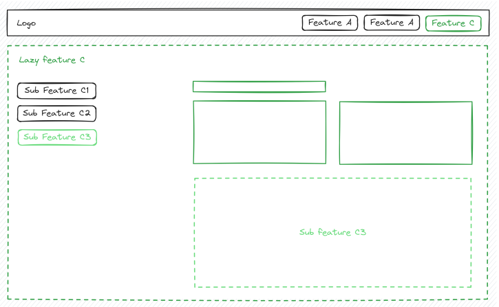

# Feature - [lazy]

**Type: feature**

With all the reusable types and building blocks in place, it’s time to start implementing actual use cases and business flows that will be used directly by our users!

- Implementation in feature/<feature-name>/ folder
- **Complete isolation between features, features can’t import from one another**
- Always lazy loaded with the help of loadChildren() (pointing to feature route config) instead of loadComponent() as that ensures uniform API and universal extendability
- The smallest possible app is an app with single / first lazy-loaded feature, this again provides consistency and universal extendability, easy to add additional features, and they all work in the same way
- Black box — can contain any kind of implementation and building blocks, Even if it gets dirty, the isolation prevents the spread, and it won’t affect the rest of the application
- Throw-away nature, because of isolation, it’s easy to throw it away and start over. On the more positive note, it also becomes easy to extract it into a library or move around.
- Large features can be further divided into lazy sub features to make them more manageable and improve bundling (2nd, 3rd, … level navigation)
- Sharing logic between features (and sub-features) follows **“extract one
  level up rule”** (e.g. into parent lazy feature, pattern, core or ui)

## Isolation and the “black box” or “throw-away” nature of lazy features

This means that each lazy feature can be treated as a “black box” which can contain any kind of implementation, building blocks and even lazy sub features.

The consequence of this is that **even if the implementation of a lazy feature gets dirty, the isolation prevents the spread of that dirtiness, and it won’t affect the rest of the application**.

Another consequence of isolation is that **lazy features can be treated as a throw-away** code which will be used as long as serves its purpose. Then, because of the isolation, it’s easy to **throw it away and replace with new better implementation instead of often much slower refactoring**.

## Nested lazy sub features

In practice, it’s also pretty common that some features will be so large that it will make sense to split them into additional lazy sub features. This goes often hand in hand with additional level of navigation in the form of a submenu commonly located in the sidebar.

The lazy sub features be specified in `children: []` array of the parent feature which means that the view of the parent and child are combined as in the diagram above.

The other option is that lazy sub features will be registered as siblings of the parent lazy feature which means they will replace parent in the view when navigated to.

## How to share logic between multiple lazy features

Sharing logic between lazy features can be summarized with the “**extract one level up rule**”, but where exactly the “**one level up**” is, depends strongly on the type of logic that we want to share.

## Types of logic that we might want to share

The main distinction in the sharing behavior depends on the level of the lazy feature, the first level lazy features will extract shared logic to the `core/` or `ui/` folder, while the nested lazy sub features will extract shared logic to the parent lazy feature.

- `ui` - standalones in the form of generic UI components, directives and pipes, only inputs and outputs, typical examples could be Avatar , Popover , Dialog , Button or Menu

  - used in more than one lazy feature on the first level, will be extracted to the `ui/` folder
  - used in more than one lazy sub feature of the same parent lazy feature will be extracted to `feature/parent-feature/` folder

- core - injectables, services and other headless logic like state management library state slices or utils, typical examples could be OrderService , OrderState (NgRx based state slice), OrderUtils

  - used in more than one lazy feature on the first level, will be extracted to the `core/` folder
  - used in more than one lazy sub feature of the same parent lazy feature will be extracted to `feature/parent-feature/` folder

- pattern - pre-packaged combination of standalones and injectables focused on implementing of a specific use case, typical examples could be DocumentManager , ItemChangeHistory or ApprovalProcess
  - used in more than one lazy feature on the first level, will be extracted to the `pattern/` folder
  - used in more than one lazy sub feature of the same parent lazy feature will be extracted to `feature/parent-feature/` folder
